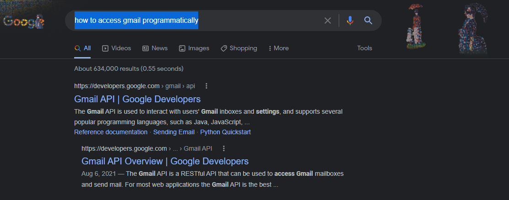

# How do I make an app
>I wanted to write down my process for preparing to make an app, and how to organize youself to make it happen

1. Be able to describe what you want to do, before there is even any code
    1. Understand the problem you are trying to solve in plain English
    2. Once you understand the issue, break it down into steps and make a blueprint or outline
#### State app/codes purpose in English
>E.G. Let's say I want to make an app that will print any email that has the word receipt in the subject
>
>That first sentence is me explaining my problem. I have emails that are receipts, I would like to print them.
>
>Let's break it up
#### Make Outline

1. Get Emails
2. Read Subject
3. If Subject contains 'Receipt', send to be printed
4. Print Email

>I think the outline is good, 3. and 4. might make you pause, why is it 2 entries instead of 1?
>
>First rule: Separate out the parts that talk with things outside your app to their own section
>
>Since getting emails and printing emails rely on talking with things outside my apps code, I want to make sure they get their own bullet point
>
>Now every bullet point in the outline needs its own place to do its work. Regardless of the coding language or framework, you will want to 'Separate your concerns' and make it possible to break down your process into chunks
>
>Now let's dig into deeper detail
#### Coordinating logic
>Pratically what does this mean? Well I would probably have some code that represents each step, for instance I would make a GetEmails class or function or separate service of some point to house the steps needed to get the emails, convert it to my expect result type, and returns that to my flow. so I may have something like this
>
> - My Main Class, this would basically just be a code repesentation of the high level outline, this is a coordinating class 
>```
>export class ReceiptPrinterCoordinatorService{
>  emailService: EmailService = new EmailService();
>  printerService: PrinterService = new PrinterService();
>  
>  getEmailsAndPrintReceipts() {
>    const allEmails = this.emailService.getEmails(); // GetEmails
>    const emailsThatNeedPrinted: GetEmailResult[] = this.readSubject(allEmails); //ReadSubject and step 3. if subject...
>    emailsThatNeedPrinted.forEach(email => {
>       // 4. Print Email    
>      printerService.printDocument(email)
>    });
>  }
>    
>  readSubject(emails) {
>    // If subject does not contain 'Receipt', remove it from array of emails here   
>  }    
>}
>```
>
>This is the entire problem. Obviously those other classes don't work, but the logic is done, now it is a matter of getting all the pieces to work.
>
>As you can see, this does nothing but coordinate the other classes and functions that will do the work. I am not worried about how the emails are found, that's the email services job. I am not worried about how to print, that's the print services job. I just have simple logic here, assuming that the email service gives me GetEmailResults, I will filter down those emails to the ones that need printing, and then pass those individually to the printer service.
#### Get Emails
>Now that I have a single problem to solve, we can think about details
>When dealing with outside sources of data (like getting emails from some email provider), I find it helpful to start at the end and work backwards.
>
> So at the end of the Get Emails phase, what do I want to have?
>
>Well the next phase is Read Subject, so I guess I will want to get the emails subject
>
> After that I will want to print the entire email body, since I am already getting the subject, I can probably get the body too.
>
>Emails also have attachments, what if the receipt comes in a pdf instead of the email body. Hmmm and interesting problem I did not think about before. I don't know how to do that, and I don't know if I will need to yet. I will write that down for later, let's start by solving the simpler problem first 

>So if I want the emails subject and email body, I can probably assume they are both just strings, they aren't numbers or booleans or anything crazy. Let's make a model to represent what we want
> ```
>export interface GetEmailResult {
>    subject: string;
>    body: string;
>}
>```
>
> Now we know the end goal, we want an array of GetEmailResult, each email should be converted to a GetEmailResult object that we can pass into the rest of our application
>I can also update my coordinating class to reflect this type expectation
>
>    - ```const allEmails: GetEmailResult[] = this.emailService.getEmails(); // GetEmails```
>
>    - ```const emailsThatNeedPrinted: GetEmailResult[] = this.readSubject(allEmails);```
>
>    - ``` readSubject(emails): GetEmailResult[] { ```
>
>
>And we can create a skeleton EmailService
>```
>export class EmailService {
>  getEmails(): GetEmailResult[] {
>     // do some email getting magic here
>  }
>}
>``` 

>Now let's continue working backwards. In order to make a GetEmailResult, I need an email from somewhere. This is where you can begin to look into how you get emails from a particular place. Maybe it's gmail, or outlook, yahoo, hotmail... maybe you want to develop a solution to do all of them?
>
>Now I can do research and narrow my google results tremendously
>let's say I am accessing a gmail account for this app. I can search 'how to access gmail programmatically'
>
> 
>
> And wouldn't you know it, first result is from Google themselves with an API to use to do exactly this

>I am not going to show how to build this app exactly, but you get the point I hope, now I am in a position to figure out how to access Gmail messages AND I have an end goal in mind. Convert messages from whatever gmail sends me, to GetEmailResult and send an array of GetEmailResults to the next part of my app
>
>Obviously this is where the real coding kind of begins, I also want to point out that I would probably create a Gmail specific service and put all the details of dealing with Gmail api in that service. so the email service might look something like this
>
>```
>  getEmails(): GetEmailResult[] {
>    const gmailService = new GmailService();
>    const emails: GmailEmailResponse[] = gmailService.getMyEmailsForLastWeek();
>    return emails.map(gmail => {subject: gmail.gmailSubject, body: gmail.messageBody})
>  }
>}
>```
>
>Again this is kind of pseudocode based on no knowledge of how to actually get emails from gmail.
>
>This extra email service acts as kind of a middle man. Coordinating the gmail pieces (see how my gmail service has a made up getMyEmailsForLastWeek function? I could change the logic here for any rules about the type or amount of emails I want to get.)
>
>By adding these layers, I don't need to have the gmail api do everything for me, I can whittle down the complexity until all I have to do is have gmail return me emails from the last week and my app will take care of the rest
>
>The Gmail service would probably have to deal with logging in, and calling the right rest call, it might have other service help it with that as well. The point is to make each class try to do one thing, either be a coordinator and translator (like the email service), or hide the complexity of a complex task to make it easier for the rest of the app to use (gmail service)
#### Jumping ahead
>Just by doing this, I can make apps sustainably and not get as lost and confused
>
>
>the entire application logic is just in a few lines of code, But now you can implement each piece step by step in a very focused manner (which will take more code, but each section is nicely segmented)